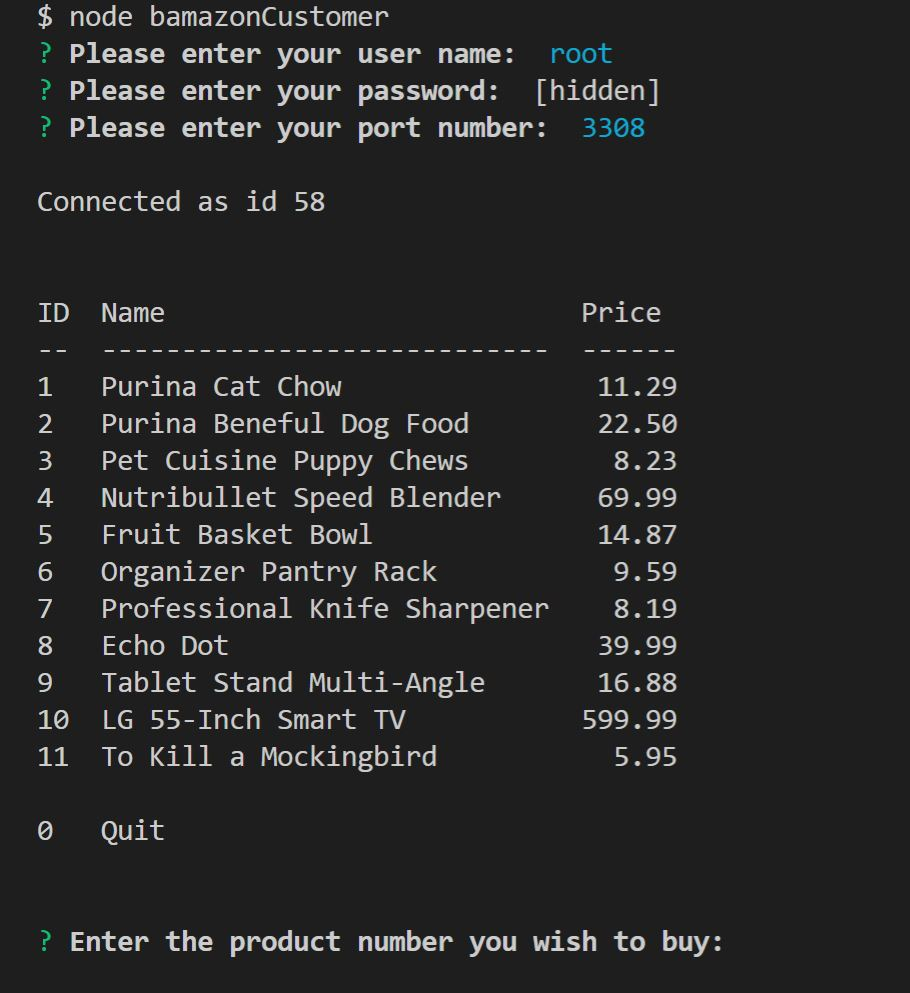
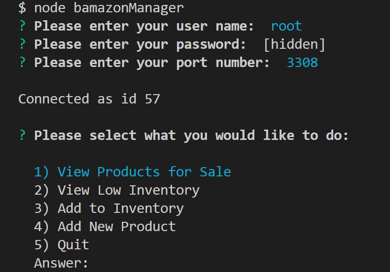
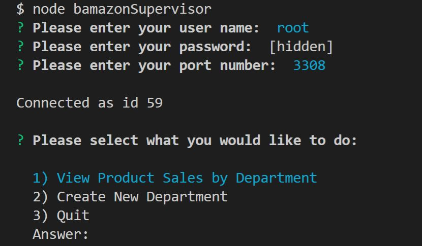

# bAmazon
Amazon-like Storefront Management System - Homework #10

This node.js application is a command line storefront management system. It also uses mySQL to maintain product and department data for the storefront.

The application consists of the following viewpoints:

1. Customer

      

2. Manager

      

3. Supervisor

      

All views start in the same manner with the command line arguments - node and filename. The application then prompts the user for database connection options. The user can choose to connect with a different user name, password, and port. Defaults are also available (root, root, and 3308). Once the database connection is established, the options vary based on the view. Please refer to the videos below for a demo of each view.

### Customer

### Manager

### Supervisor

## Getting Started

You should be able to download the files via the github pages link below and run locally on your computer:
[https://github.com/emswann/bAmazon.git](https://github.com/emswann/bAmazon.git).

## Prerequisites

NPM install based on package.json.

Use the schema.sql file to create the database schema.

Use the seeds.sql file to populate the database with some sample data.

## Built With

* [node.js](https://nodejs.org/en/) - Server side programming language.
* [easy-table](https://www.npmjs.com/package/easy-table) - Utility for rendering text tables.
* [inquirer](https://www.npmjs.com/package/inquirer) - Interactive command line user interfaces.
* [mysql](https://www.npmjs.com/package/mysql) - node.js driver for mySql.

## Contributing

Please feel free to offer any suggestions. As always, programming is a work of art in progress.

## Author

* **Elaina Swann** - [Github](https://github.com/emswann)